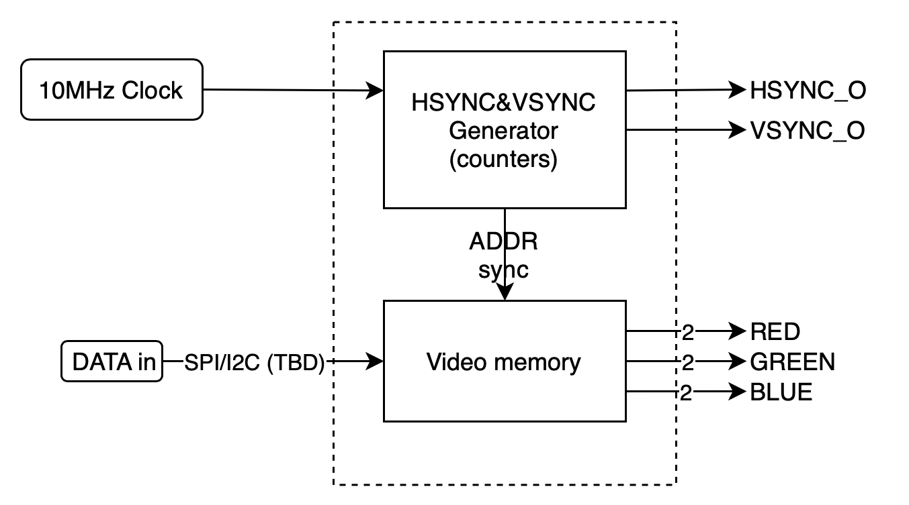
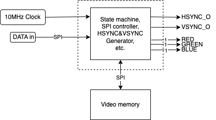

# TinyVideocard

A Tiny VGA Output generator project for TinyTapeout.

> Note : This project was done for a microelectronics course at the [ECAM Brussels Engineering School](https://www.ecam.be/).

## Table of Contents

- [Why](#why)
- [What](#what)
- [How](#how)
- [Sources, License & Acknowledgements](#sources-license--acknowledgements)

## Why

When I saw Ben Eater's video about a [video card on a breadboard](https://www.youtube.com/watch?v=l7rce6IQDWs), I was amazed by how "simple" it was to create the signals needed to drive a VGA display. I wanted to try it myself, but I didn't want to recreate it just for the sake of it, without a real use case.  
Se, when we had to choose a project for our microelectronics course, I decided to base my design on Ben Eater's video card, but with a twist : it had to be small enough to fit on a TinyTapeout Design slot.

## What

TODO

## How

### Figuring out the timings

The first thing I had to do was to figure out the timings of the VGA signal. I found a [some info](http://www.tinyvga.com/vga-timing) about the possible VGA resolutions and their timings, and settled on a resolution of [800x600@60Hz](http://www.tinyvga.com/vga-timing/800x600@60Hz), as per Ben Eater's project.  
This choice may change in the future, as the max clock speed details of [TinyTapeout's new MUX design](https://github.com/TinyTapeout/tt-multiplexer) are not yet known.

With a 10MHz clock, the timing details are as follow :

#### General Timing

| | |
|-|-:|
| Screen refresh rate | 60Hz |
| Vertical refresh | 37.878787878788 kHz |
| Pixel frequency | **10MHz**

#### Horizontal Timing (line)

| Scanline part | Pixels | Time [µs] |
|-|-:|-:|
| Visible area | 200 | 20 |
| Front porch | 10 | 1 |
| Sync pulse | 32 | 3.2 |
| Back porch | 22 | 2.2 |
| Whole line | 264 | 26.4 |

#### Vertical Timing (frame)

| Frame part | Lines | Time [ms] |
|-|-:|-:|
| Visible area | 600 | 15.84 |
| Front porch | 1 | 0.0264 |
| Sync pulse | 4 | 0.1056 |
| Back porch | 23 | 0.6072 |
| Whole frame | 628 | 16.5792 |

TODO : complete

### Block diagram

*First block diagram of the idea*  

*Second block diagram of the idea*

## Sources, License & Acknowledgements

- *Let's build a video card!*, Ben Eater, 2019, [eater.net/vga](https://eater.net/vga)
- TinyTapeout design guides, [tinytapeout.com](https://tinytapeout.com)

Made with ❤️, lots of ☕️, and lack of 🛌

Published under CreativeCommons BY-SA 4.0

  
This work is licensed under a [Creative Commons Attribution-ShareAlike 4.0 International License](https://creativecommons.org/licenses/by-sa/4.0/).
