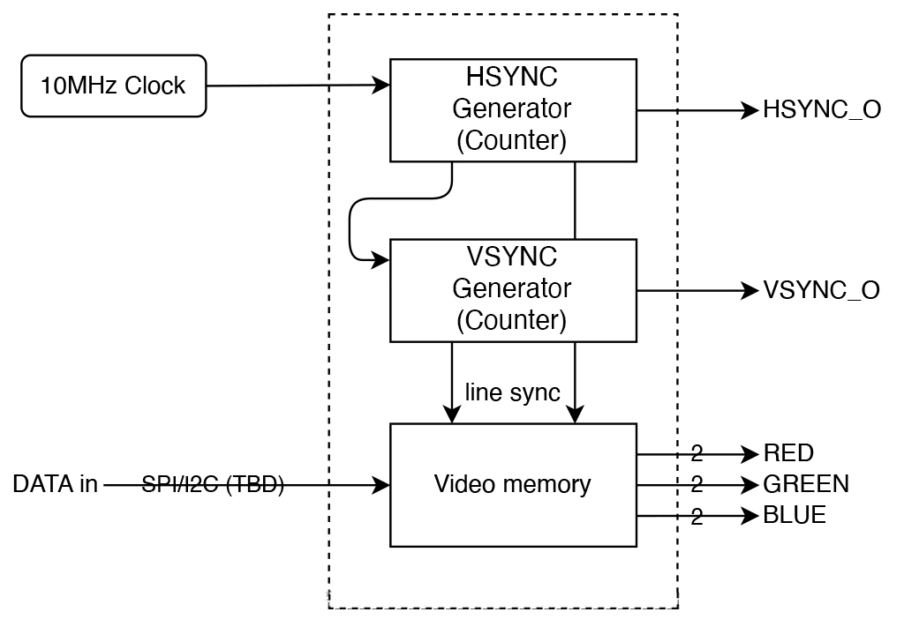

# TinyVideocard

A Tiny VGA Output generator project for TinyTapeout.

> Note : This project was done for a microelectronics course at the [ECAM Brussels Engineering School](https://www.ecam.be/).

## Table of Contents

- [Why](#why)
- [What](#what)
- [How](#how)
- [Sources, License & Acknowledgements](#sources-license--acknowledgements)

## Why

When I saw Ben Eater's video about a [video card on a breadboard](https://www.youtube.com/watch?v=l7rce6IQDWs), I was amazed by how "simple" it was to create the signals needed to drive a VGA display. I wanted to try it myself, but I didn't want to recreate it just for the sake of it, without a real use case.  
Se, when we had to choose a project for our microelectronics course, I decided to base my design on Ben Eater's video card, but with a twist : it had to be small enough to fit on a TinyTapeout Design slot.

## What

TODO

## How

TODO

*First block diagram of the idea*  

## Sources, License & Acknowledgements

- *Let's build a video card!*, Ben Eater, 2019, [eater.net/vga](https://eater.net/vga)
- TinyTapeout design guides, [tinytapeout.com](https://tinytapeout.com)

Made with ❤️, lots of ☕️, and lack of 🛌

Published under CreativeCommons BY-SA 4.0

  
This work is licensed under a [Creative Commons Attribution-ShareAlike 4.0 International License](https://creativecommons.org/licenses/by-sa/4.0/).
